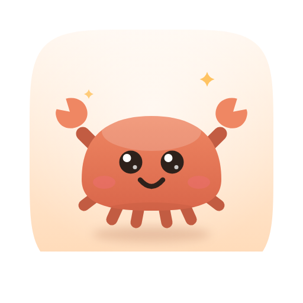
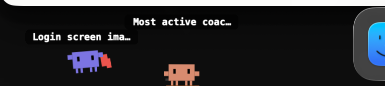
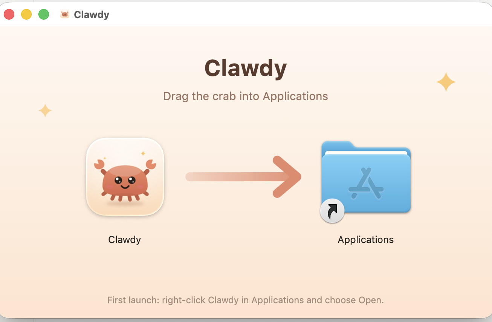

<p align="center">
  
</p>

<h1 align="center">Clawdy</h1>

<p align="center">
  A little crab for every Claude session, along the bottom of your Mac screen.<br>
  One glance: who is working, who is done, who needs you.
</p>

<p align="center">
  <a href="LICENSE"></a>
  
  
  
</p>

<p align="center">
  
</p>

## The poses

Every live session — Claude Code, the Desktop Code tab, Cowork — gets a pet in the
wallpaper gap beside your Dock, never under it. The pose is the status.

| The pet is… | The session is… |
| --- | --- |
| busy — thinking, juggling, debugging | working, or running a tool |
| praying | waiting on your approval |
| puzzled | done, and it asked you something |
| celebrating | done, and you have not looked yet |
| pottering about | done, and you have seen it |
| dizzy | stopped on an error |
| asleep | quiet for ten minutes |

## Good to know

- **"Done" clears when you look at the chat**, not when you dismiss a badge. A
  locked or sleeping screen never counts as looking.
- **Click a pet to jump to its chat** — which counts as looking, so it relaxes.
- **Shell colour is per project.** Every crab in the same folder wears the same shell.
- **Sub-agents are baby crabs** trailing their parent. Hover any pet for what it is
  doing, for how long, and where.
- **Drag them wherever you like.** Clicks on empty desktop pass straight through.
- **Pets leave after five minutes idle** unless they still need you.

Nothing leaves your Mac. Clawdy only reads files Claude already writes.

## Install

Grab the latest `Clawdy-<version>.dmg` from
[Releases](https://github.com/jonasgoth/clawdy/releases) and drag the crab onto
Applications. It is ad-hoc signed, not notarized, so the first launch wants a
right-click → **Open**.



Or build it — Xcode or the Command Line Tools, then:

```bash
git clone https://github.com/jonasgoth/clawdy.git
cd clawdy
./build.sh --run          # tools/make-dmg.sh wraps the same app in a DMG
```

Always go through `build.sh`: the bare binary in `.build/` has no artwork beside
it and falls back to a plain pixel crab.

## The menu

The menu bar crab counts your sessions and turns red when one needs you. Its menu
lists them — click a row to go to that chat — over four switches: **Crab
visibility**, **Sounds**, **Crab positions**, and **Instant updates**, which
installs Claude Code hooks so pets react the moment something happens (it edits
`~/.claude/settings.json`, and backs it up first).

## How it works

Clawdy reads what Claude already leaves on disk: the live-session list in
`~/.claude/sessions`, the transcripts in `~/.claude/projects`, the Desktop app's
chat metadata, and Cowork's audit log. FSEvents does the watching, so it idles at
a few percent CPU. [PLAN.md](PLAN.md) has the full design, including the "seen"
rule.

```bash
CLAWDY_DEBUG=1 build/Clawdy.app/Contents/MacOS/Clawdy   # watch it think
```

## The art

Pets, app icon and installer backdrop are all drawn by script — SVG in, PNG out,
via Google Chrome. Re-run only when the drawings change.

```bash
tools/render-pets.py            # Assets/pets/<state>.png + manifest.json
tools/make-icon.py              # Assets/AppIcon.svg + .png + .icns
tools/make-dmg-background.py    # Assets/dmg/background.tiff
```

## Credits

- The animated pets are **[clawd-pet](https://github.com/abderrahimghazali/clawd-pet)**
  by Abderrahim Ghazali (MIT) — browse them at [clawd-pet.vercel.app](https://clawd-pet.vercel.app).
- The pixel baby crabs come from [claude-status-bar](https://github.com/m1ckc3s/claude-status-bar)
  by m1ckc3s (MIT).
- Inspired by [so-agentbar](https://github.com/sotthang/so-agentbar).

Issues and pull requests welcome; a debug log helps a lot. "Claude" and Clawd
belong to Anthropic — Clawdy is an unofficial side project, not affiliated with or
endorsed by them. See [Assets/ATTRIBUTION.md](Assets/ATTRIBUTION.md).

## License

[MIT](LICENSE). Covers the code in this repository only, and conveys no rights to
Anthropic's trademarks or artwork.
